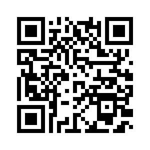

# Research, Development, and Innovation in Statistics Education (REDEVISE)

*March 24, 2025*

## Consortium for the Advancement of Undergraduate Statistics Education (CAUSE)

- <https://www.causeweb.org>
- U.S.-based organization whose mission is to support and advance undergraduate statistics education, in four target areas: resources, professional development, outreach, and research.
    - **eCOTS (electronic conference on teaching statistics)**: every two years; primary event is virtual but we also support regional in-person events paid for by sponsors and registration fees.
    - USCOTS (US Conference on Teaching Statistics)
    - **USPROC and eUSR**: project competition and a conference specifically for undergraduate students
    - Fun collection/caption contest/A-mu-sing contest/VOICES conference
    - Research Program: mini conferences, research reading groups, and new community building projects
    - CAUSE/ASA JEDI initiative
    - **SDSE Webinars**
    - Hosting SBI, STUB, TSHS, & Chance News portals

## Guidelines for Assessment and Instruction in Statistics Education (GAISE)

- Initiative supported by the American Statistical Association
- Website: <https://www.amstat.org/education/guidelines-for-assessment-and-instruction-in-statistics-education-(gaise)-reports>
    - Grade school (preK-12) and University (College) 
    - Revision (ongoing): <https://community.amstat.org/collegegaiserevision/revised-gaise-ten-recs>
    - Assessment Committee Work (Recc #9)

## 2025 Penn State Statistics Research Day

[One-page Lightning Talk Slide (PDF)](docs/2025-PSU-Stat-Research-Day.pdf)

### NLP-assisted formative assessment feedback

#### Associated Papers:

Beckman, M. D., Burke, S., Fiochetta, J., Fry, B., Lloyd, S. E., Patterson, L., & Tang, E. (in review). Developing Consistency Among Undergraduate Graders Scoring Open-Ended Statistics Tasks. Preprint URL: https://arxiv.org/abs/2410.18062 

Li, Z., Lloyd, S., Beckman, M. D., & Passonneau, R. J. (2023). Answer-state Recurrent Relational Network (AsRRN) for Constructed Response Assessment and Feedback Grouping. *Findings of the Conference on Empirical Methods in Natural Language Processing (EMNLP) 2023*.  <https://doi.org/10.18653/v1/2023.findings-emnlp.254>

Lloyd, S., Beckman, M., Pearl, D., Passonneau, R., Li, Z., & Wang, Z. (2022). Foundations for AI-Assisted Formative Assessment Feedback for Short-Answer Tasks in Large-Enrollment Classes. In *Proceedings of the eleventh international conference on teaching statistics*. Rosario, Argentina.

 
### Statistics & Data Science Education Research Interests

#### Educational Assessment

  - **developing and analyzing tools** intended to measure specific learning outcomes, etc. Novel approaches to educational measurement.
  - "tests" for research use across academic institutions; e.g., **intro data science**, intro **statistics**, **capstone assessment** just before graduation in statistics
  - formative assessment; e.g., feedback for self-regulated learning and/or adaptive instruction

Phadke, S., Beckman, M.D., Lock Morgan, K. (2024). Examining the role of context in statistical literacy assessment. *Statistics Education Research Journal, 23*(1). <https://doi.org/10.52041/serj.v23i1.529>

Lloyd, S., Beckman, M., Pearl, D., Passonneau, R., Li, Z., & Wang, Z. (2022). Foundations for AI-Assisted Formative Assessment Feedback for Short-Answer Tasks in Large-Enrollment Classes. In *Proceedings of the eleventh international conference on teaching statistics*. Rosario, Argentina.

#### Data Science Education

  - exploring intersection of stat education & computing education
  - studying **DS/CS topics introduced as learning objectives in statistics** curricula
  - Data literacy, data acumen, EDA for DS

Hu, A, Hatfield, N. J., Beckman, M. D. (2025). Exploring How Novices and Experts Engage in Computational Thinking with Data. *ZDM Mathematics Education.* 

Beckman, M. D., Cetinkaya-Rundel, M., Horton, N. J., Rundel, C. W., Sullivan, A. J., & Tackett, M. (2021). Implementing Version Control With Git and GitHub as a Learning Objective in Statistics and Data Science Courses. *Journal of Statistics and Data Science Education, 29*(1). https://doi.org/10.1080/10691898.2020.1848485

#### Teaching & Learning

  - **mechanisms to promote efficient learning** outcomes
  - cognitive transfer, i.e., flexible/portable learning to be applied beyond the classroom
  - cognitive load, i.e., stresses on student bandwidth during learning processes

Beckman, M. D., & delMas, R. C. (2018). Statistics students' identification of inferential model elements within contexts of their own invention. *ZDM Mathematics Education 50*(7). DOI: 10.1007/s11858-018-0986-5

### Contact

Matthew Beckman  
Assoc Research Professor | Dept of Statistics   
Director | CAUSE (<https://causeweb.org/>) 

UoA office: 303S-375  
email: mdb268 [at] psu [dot] edu  
webpage: <https://mdbeckman.github.io/>

 

### QR Code for this page

